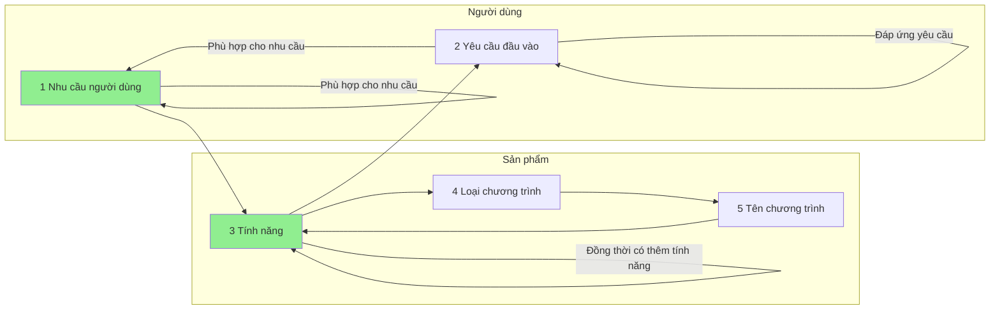

## Mối quan hệ giữa các khái niệm
- Nhu cầu người dùng sẽ đòi hỏi tính năng
- Tính năng sẽ đòi hỏi yêu cầu đầu vào 
- Yêu cầu đầu vào đòi hỏi nhu cầu người dùng
<br>
- Tính năng sẽ quyết định loại chương trình
- Chương trình đáp ứng một tổ hợp các nhu cầu của người dùng bằng một tổ hợp các tính năng 



## Danh mục
```dataview
list rows.file.link
from "Tài nguyên hỗ trợ/Quang cảnh thị trường/Chương trình quản lý tiền"   
group by split(file.folder, "/" )[3] 
```

- Có những chương trình không biết nên phân loại thế nào. Tốt nhất là liệt kê tính năng của nó
- Khi một "nhu cầu" của người dùng thực ra là do không có nhu cầu thì nó nên là gì?
- Khi một "tính năng" của chương trình thực ra là do không có tính năng thì nó nên là gì?