[[3 Ý tưởng|So sánh các yêu cầu đầu vào của các ý tưởng kiếm tiền]]
## Mối quan hệ giữa các khái niệm

```mermaid
flowchart LR
	1["1 Yêu cầu đầu vào"]
	2["2 Hình thức"]
	3["3 Ý tưởng"]

3-->1
3-->2
style 3 fill:lightgreen
```


## Danh mục
```dataview
list rows.file.link
from "📜Tài nguyên/Ý tưởng kiếm tiền"   
group by split(file.folder, "/" )[3] 
```

